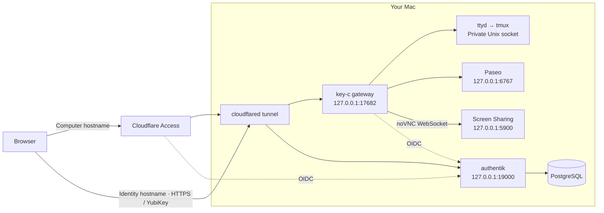

# key-c

YubiKey-protected browser access to your Mac's **terminal**, **Paseo coding agents**, and **desktop through noVNC**. Use **All apps** to switch between them.

- **30-second key reuse:** immediate login redirects and refreshes can reuse the same browser's YubiKey check. Reuse does not extend the window; signing in or refreshing after it expires requires the key again.
- **One active browser session:** signing in elsewhere replaces the previous session.
- **Two-minute idle lock:** input keeps the session open; app output alone does not. **Lock**, connection loss, and login expiry also end browser access.

Disconnecting leaves tmux work and desktop applications running. Locking key-c does not lock the physical Mac.

## Architecture



Both hostnames use the same tunnel. Access protects the computer hostname; the identity hostname stays reachable for OIDC with management/enrollment routes blocked. The gateway validates Access and completes its own authentik login. authentik and PostgreSQL run in a dedicated Colima VM; noVNC is served by the gateway. Cloudflare terminates public HTTPS.

## Setup

Requirements: macOS, Node.js 24, Python 3, Docker CLI with Compose v2, Colima, cloudflared, ttyd, and tmux on `PATH`; a Cloudflare-managed domain/Zero Trust team; a FIDO2 YubiKey with PIN and a compatible USB/NFC browser. Keep the Mac awake, online, and logged in, with a separate local administrator/recovery path.

The pinned Paseo terminal prebuild has been tested on Apple Silicon; verify native dependencies on other platforms. Use a **dedicated authentik instance**: setup changes its default login flows. Run commands from this checkout, in order.

### 1. Private configuration

Create a self-hosted Cloudflare Access application for `computer.<your-domain>` with **Block Everyone**. Record its audience (AUD) and team domain; leave the computer hostname unrouted.

```sh
npm ci --ignore-scripts
umask 077
KEY_C_RUNTIME="$HOME/Library/Application Support/key-c"
mkdir -p "$KEY_C_RUNTIME/secrets"
cp config/deployment.example.json "$KEY_C_RUNTIME/secrets/deployment.json"
```

Edit that JSON with distinct computer/identity hostnames, team domain, AUD, owner email/username/display name, and key-model AAGUID. Templates are rejected. All `secrets/...` paths below refer to this private runtime directory, outside Git.

To read the attached key's AAGUID without enrollment:
```sh
python3 -m venv .venv
.venv/bin/pip install fido2
.venv/bin/python -c 'from fido2.hid import CtapHidDevice; from fido2.ctap2 import Ctap2; [print(Ctap2(d).get_info().aaguid) for d in CtapHidDevice.list_devices()]'
```
Choose the intended key if several are attached. authentik must recognize its metadata as a YubiKey.

### 2. Identity service

```sh
bin/init-secrets
colima start key-c --cpu 2 --memory 4 --activate=false --edit
```

Set `mounts: []` in Colima's editor. Confirm `docker --context colima-key-c info` succeeds, then run `bin/compose up -d`. Check `bin/compose ps` until PostgreSQL, authentik server, and worker are healthy; verify `http://127.0.0.1:19000` responds locally.

[compose.yml](compose.yml) pins authentik 2026.8.3 and uses named volumes. Private `secrets/authentik.env` contains generated credentials; the initial admin is `akadmin` with its bootstrap password. Bootstrap values initialize only a fresh database; `bin/init-secrets` never overwrites them.

### 3. Protected key enrollment

1. Create a temporary Access application covering the **entire identity hostname**. Allow only your owner email through an existing identity provider or one-time email code. Confirm anonymous requests are blocked before publishing its route.
2. Create a named Cloudflare Tunnel; save its token in `secrets/tunnel-token` with mode `0600`. Route **only** the identity hostname to `http://127.0.0.1:19000`, followed by a catch-all 404. Point its proxied DNS record to the tunnel and run `bin/tunnel` separately. Keep the computer blocked and unrouted.
3. Open `https://auth.<your-domain>`, pass temporary Access protection, and log in as `akadmin`. **Keep this admin session open.**
4. Run `bin/configure-authentik.py`, then `bin/configure-fresh-login.py`. They create the owner/providers and private `authentik-state.json`, `secrets/oidc.json`, and `secrets/fresh-oidc.json`. They disable default password/enrollment flows.
5. In the existing admin session, [impersonate the owner](https://docs.goauthentik.io/users-sources/user/user_basic_operations). Open `https://auth.<your-domain>/if/flow/key-c-key-enrollment/`, select the physical YubiKey, enter its PIN, and touch it. Enrollment permits only the owner with no existing key; use this final HTTPS hostname, not localhost.
6. End impersonation and revoke temporary bootstrap sessions/recovery tokens. Apply the identity-route rules in [config/cloudflare.example.json](config/cloudflare.example.json) **in order**: block admin/recovery/enrollment pages, allow the listed login APIs, deny other APIs, and retain the catch-all 404. Keep the computer unrouted.
7. Only then remove temporary Access protection from the identity hostname so OIDC sign-in is reachable. If setup fails, retain owner-only protection and the computer block while restoring local admin access.

Upgrading to 30-second reuse: rerun both configuration scripts so login and both authorization flows share the same validation stage.

### 4. Cloudflare Access

Add a [generic OIDC provider](https://developers.cloudflare.com/cloudflare-one/integrations/identity-providers/generic-oidc/) using `secrets/oidc.json`. Get authorization, token, and JWKS endpoints from `https://auth.<your-domain>/application/o/key-c-cloudflare/.well-known/openid-configuration`. Use callback `https://<your-team>.cloudflareaccess.com/cdn-cgi/access/callback`, scopes `openid email profile`, and the `email` claim.

For the computer application, select only this provider, require it in the allow policy, and include only the owner email. Set a one-hour session, HttpOnly cookies, and SameSite Lax. Replace Block Everyone only when this policy is ready; add no bypass, service-token, or alternate email-code policies.

Replace every placeholder in [config/cloudflare.example.json](config/cloudflare.example.json) and apply its final tunnel/application/policy settings. Route the computer hostname to `http://127.0.0.1:17682` with the same required Access audience as `deployment.json`. Point both proxied DNS records to the tunnel.

### 5. Local apps

Paseo uses `~/.paseo` and port 6767. Back up any existing home, preserve keypair/pairing files, and stop its old supervisor first. Resolve existing daemon passwords or port conflicts before using this passwordless-loopback integration. Configure provider credentials through each agent CLI, outside Git.

Stop the foreground tunnel, then:
```sh
npm test
bin/install-paseo
bin/install-local
bin/install-services
bin/control status
```

Services run as your Mac user after login; grant macOS privacy permissions through System Settings. New Paseo homes disable relay; existing settings are preserved. Phone pairing/relay bypasses key-c's YubiKey, idle-lock, and single-browser rules; keep pairing links private.

### 6. Desktop

Turn Screen Sharing **off**, then run `sudo python3 bin/setup-novnc` locally in an interactive terminal. Follow its prompts: allow only your Mac account, disable permission requests, and leave legacy VNC-password access off. noVNC uses your Mac username/password; decline browser password-saving prompts.

The helper temporarily blocks network VNC traffic and installs a loopback listener using `/Library/key-c/screensharing.plist` and `/Library/LaunchDaemons/com.keyc.screensharing.plist`, leaving Apple's wildcard listener disabled. It requires the standard macOS firewall anchor/service layout; it does not edit `/System` or disable SIP. Failed setup attempts to stop Screen Sharing and retains its firewall guard if isolation is unconfirmed.

After setup, reboot, macOS updates, or Sharing changes, run `sudo lsof -nP -iTCP:5900 -sTCP:LISTEN`: only `127.0.0.1:5900` and optionally `[::1]:5900` should listen. Resolve any network-facing listener before proceeding. Remove with `sudo python3 bin/setup-novnc --remove`; Screen Sharing remains disabled.

## Operation and recovery

Use `bin/control status`, `bin/control stop`, and `bin/control start`. Logs/runtime live in `~/Library/Application Support/key-c`; user agents are `~/Library/LaunchAgents/com.keyc.remote-*.plist`. Stopping unloads those agents and stops the shared Paseo daemon; tmux, data, and identity containers remain. To stop containers too, run `bin/compose stop` after stopping the agents.

Before relying on access, test all three apps, key reuse before/after 30 seconds, idle lock, browser replacement, reboot/sleep-wake, and local recovery. Public management/recovery/enrollment routes must return 404, including management APIs with an admin token.

Back up the PostgreSQL volume, private runtime credentials/state, and `~/.paseo` outside Git. For a lost key: stop public access, use the local identity service's administrator recovery tools, temporarily reopen enrollment on the final HTTPS hostname under owner-only protection, then close enrollment and revoke temporary access. The first-key-only policy requires a deliberate local admin change for replacement/spare keys. Test recovery while your key still works; leave no public password/email recovery fallback.
