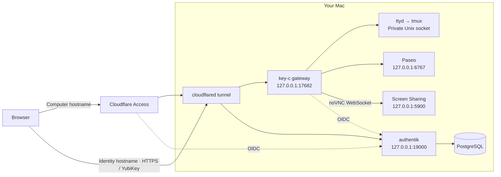

# key-c

Secure browser access to your Mac **terminal**, **Paseo agents**, and **desktop (noVNC)** using a YubiKey.

## Security model

- **YubiKey gate**: Sign-in requires a FIDO2 YubiKey.
- **30s key reuse**: Redirects/refreshes in the same browser can reuse the last check for 30 seconds.
- **Single browser session**: A new login invalidates the previous browser session.
- **2-minute idle lock**: User input resets the timer; output alone does not.
- **Session end events**: Lock, connection loss, and login expiry end browser access.

> Disconnecting does not stop tmux sessions or desktop apps. Locking key-c does not lock the physical Mac.

## Architecture



Both hostnames use one tunnel. Cloudflare Access protects the computer hostname, while the identity hostname stays reachable for OIDC (with sensitive routes blocked). `authentik` and PostgreSQL run in a dedicated Colima VM.

## Setup

### Requirements

- macOS
- Node.js 24
- Python 3
- Docker CLI with Compose v2
- Colima
- cloudflared
- ttyd
- tmux
- Cloudflare-managed domain + Zero Trust team
- FIDO2 YubiKey (PIN set) and compatible USB/NFC browser

Keep the Mac awake, online, and logged in. Maintain a separate local admin/recovery path.

> Use a dedicated `authentik` instance. Setup modifies default login flows.

### 1) Private configuration

Create a Cloudflare Access app for `computer.<your-domain>` with **Block Everyone**. Record the app AUD and team domain.

```sh
npm ci --ignore-scripts
umask 077
KEY_C_RUNTIME="$HOME/Library/Application Support/key-c"
mkdir -p "$KEY_C_RUNTIME/secrets"
cp config/deployment.example.json "$KEY_C_RUNTIME/secrets/deployment.json"
```

Edit `deployment.json` with:
- computer/identity hostnames
- Cloudflare team domain and AUD
- owner email/username/display name
- YubiKey model AAGUID

All `secrets/...` paths are in this private runtime directory (outside Git).

Optional AAGUID lookup:
```sh
python3 -m venv .venv
.venv/bin/pip install fido2
.venv/bin/python -c 'from fido2.hid import CtapHidDevice; from fido2.ctap2 import Ctap2; [print(Ctap2(d).get_info().aaguid) for d in CtapHidDevice.list_devices()]'
```

### 2) Identity service

```sh
bin/init-secrets
colima start key-c --cpu 2 --memory 4 --activate=false --edit
```

Set `mounts: []` in the Colima editor, then run:

```sh
docker --context colima-key-c info
bin/compose up -d
bin/compose ps
```

Wait until PostgreSQL, authentik server, and authentik worker are healthy. Verify `http://127.0.0.1:19000` locally.

`compose.yml` pins authentik `2026.8.3` and uses named volumes. `secrets/authentik.env` stores generated credentials.

### 3) Protected key enrollment

1. Temporarily protect the full identity hostname with Access (owner-only).
2. Create a named Cloudflare Tunnel; store token in `secrets/tunnel-token` (`0600`).
3. Route only identity hostname to `http://127.0.0.1:19000`, then catch-all 404.
4. Run `bin/tunnel`, open `https://auth.<your-domain>`, log in as `akadmin`, and keep that admin session open.
5. Run:
   ```sh
   bin/configure-authentik.py
   bin/configure-fresh-login.py
   ```
6. In the existing admin session, impersonate owner and complete key enrollment at `https://auth.<your-domain>/if/flow/key-c-key-enrollment/`.
7. Revoke temporary bootstrap sessions/recovery tokens.
8. Apply identity route rules from `config/cloudflare.example.json` in order.
9. Remove temporary identity-host Access protection only after enrollment and route hardening succeed.

If setup fails, keep computer access blocked while restoring local admin access.

### 4) Cloudflare Access OIDC

Create a generic OIDC provider in Cloudflare using `secrets/oidc.json`.

Use discovery endpoints from:
`https://auth.<your-domain>/application/o/key-c-cloudflare/.well-known/openid-configuration`

Set callback:
`https://<your-team>.cloudflareaccess.com/cdn-cgi/access/callback`

Use scopes `openid email profile` and claim `email`.

For the computer app policy:
- only this OIDC provider
- allow only owner email
- 1-hour session
- HttpOnly cookies
- SameSite=Lax
- no bypass/service-token/alternate email-code rules

Replace placeholders in `config/cloudflare.example.json` and route computer hostname to `http://127.0.0.1:17682`.

### 5) Local apps

Before installation:
- back up existing `~/.paseo`
- preserve keypair/pairing files
- stop old Paseo supervisor
- resolve daemon password/port conflicts

Then run:

```sh
npm test
bin/install-paseo
bin/install-local
bin/install-services
bin/control status
```

### 6) Desktop (noVNC)

Turn Screen Sharing off, then run:

```sh
sudo python3 bin/setup-novnc
```

Follow prompts:
- allow only your Mac account
- disable permission requests
- keep legacy VNC password access off

Validate after setup/reboot/updates:

```sh
sudo lsof -nP -iTCP:5900 -sTCP:LISTEN
```

Only `127.0.0.1:5900` (and optionally `[::1]:5900`) should listen.

Remove setup with:

```sh
sudo python3 bin/setup-novnc --remove
```

## Operation

Use:
- `bin/control status`
- `bin/control stop`
- `bin/control start`

Runtime/logs: `~/Library/Application Support/key-c`.

Stopping agents does not stop identity containers; run `bin/compose stop` if needed.

## Recovery and validation checklist

Before relying on remote access:
- test terminal, Paseo, and desktop access
- test key reuse before/after 30 seconds
- test idle lock and browser replacement
- test reboot/sleep-wake behavior
- verify blocked management/recovery/enrollment routes return `404`

Back up:
- PostgreSQL volume
- private runtime secrets/state
- `~/.paseo`

Lost key recovery flow:
1. Disable public access.
2. Recover through local authentik admin path.
3. Temporarily reopen enrollment on final HTTPS hostname (owner-only).
4. Enroll replacement key.
5. Re-close enrollment and revoke temporary access.

Do not leave password/email fallback recovery exposed publicly.
